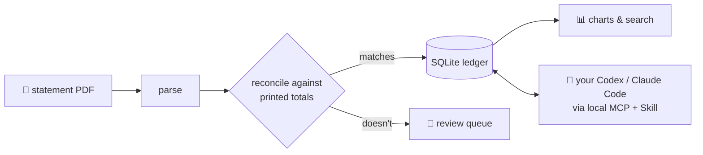

<div align="center">


# ledgerbox

**开源的本地 AI 账本 · A local-first personal ledger that refuses numbers it cannot prove.**

[](https://github.com/51351879/Open-ledgerbox/actions)
[](LICENSE)
[](#-scope-what-actually-works)
[](CHANGELOG.md)

**English** · [简体中文](README.zh-CN.md)

Drop a bank statement PDF on a page running on **your own machine**.
It is parsed, **reconciled against the statement's own printed totals**, and only then booked.
Your own AI — Codex or Claude Code — classifies it through a strict local bridge.
Nothing ever leaves your computer unless you connect it yourself.

</div>

---

## Highlights

|  |  |
|---|---|
| 🏠 **Local-first** | One SQLite file in a folder you choose. No cloud, no account, no telemetry, no API key. |
| 🧾 **Reconciled, or refused** | Every import must match the statement's printed totals. Books that don't balance go to a review queue — never into your charts. |
| 🤖 **Bring your own AI** | Connect the Codex or Claude Code **you already have** via MCP + an official Skill. ledgerbox itself never calls a model. |
| 🧠 **It learns from you** | Answer a merchant once and every identical line — now and in future imports — follows. Decree standing rules ("every outgoing Zelle is cash spending") for the rest. |
| 💰 **Big money gets a human look** | Lines over $1,000 that no person confirmed sit on their own board until you look at them. |
| 🔍 **Honest by construction** | Integer cents only. Content-hash identity. Every answer says who decided it — a rule, the AI, your earlier answer, or you. |

## How it works



The AI proposes; the ledger applies **atomically with provenance** and can withdraw a whole run.
When evidence is thin the AI must abstain — guessing about your money is a refused move, not a feature.

## Quick start

```bash
git clone https://github.com/51351879/Open-ledgerbox.git
cd Open-ledgerbox
```

**The one-sentence way** — open Codex or Claude Code in the folder and say:

> 帮我 set up 这个项目 / set this project up

The checked-in setup Skill asks where your data should live, then runs everything.

**The manual way:**

```bash
python -m venv .venv
.venv\Scripts\pip install -e .[mcp]
.venv\Scripts\ledgerbox setup --client claude --data-dir C:\ledger-data\my
```

Then double-click `start-ledgerbox.cmd`, open the page, and drop a statement on it.

## ⚠️ Scope: what actually works

"Supported" here means **validated against real statements on real hardware** — nothing else earns the word.

| Input | Status |
|---|---|
| Chase (US) personal **checking** PDF | ✅ Validated against 13 real statements |
| Generic **CSV** (map your own columns) | 🔜 Planned — covers most banks and cards |
| Other banks / credit cards / brokerage | ❌ Not yet — see [Adding a bank](docs/ADDING_A_BANK.md) |

| Platform | Status |
|---|---|
| Windows 11 + PowerShell + Chromium browser | ✅ Supported; every gate runs here |
| Windows Narrator (Agent flows) | ✅ Real acceptance pass |
| macOS / Linux / other browsers & screen readers | ❌ Untested — community PRs with their own validation welcome |

Not yet on PyPI — run from a checkout. No cloud sync, no bank-login scraping, no mobile app, ever ([why](docs/AUTOMATION.md)).

## Your data

```
<your folder>/          ← you choose it; must be outside any git repo
├── ledger.db           ← the ledger (SQLite, integer cents)
├── archive/            ← original PDFs, content-addressed
└── expected-totals.json… and everything else stays on your disk
```

Loopback only, no authentication — don't expose it beyond your machine.
The AI bridge exposes **five read/propose tools**, no SQL, no file paths; every
transaction descriptor is treated as untrusted data. Details: [THREAT_MODEL](docs/THREAT_MODEL.md) · [SECURITY](SECURITY.md).

## Learn more

| | |
|---|---|
| The audit that started this project | [docs/PROJECT_SUMMARY.md](docs/PROJECT_SUMMARY.md) |
| Architecture and design decisions | [docs/ARCHITECTURE.md](docs/ARCHITECTURE.md) · [docs/STATUS.md](docs/STATUS.md) |
| Connecting Codex / Claude Code | [docs/AGENT_SETUP.md](docs/AGENT_SETUP.md) |
| Adding your bank | [docs/ADDING_A_BANK.md](docs/ADDING_A_BANK.md) |
| Contributing | [CONTRIBUTING.md](CONTRIBUTING.md) |
| What changed | [CHANGELOG.md](CHANGELOG.md) |

**Why it exists, in one breath:** the author's previous parser silently misread a balance column as income for a year — a 78% savings rate that was really ≈ zero — while every statement had the correct totals printed on page one. A fifteen-line reconciliation assertion would have caught it on day one. That assertion, taken seriously everywhere, is this whole project.

## License

[AGPL-3.0-or-later](LICENSE) — free for everyone, and improvements stay free.
