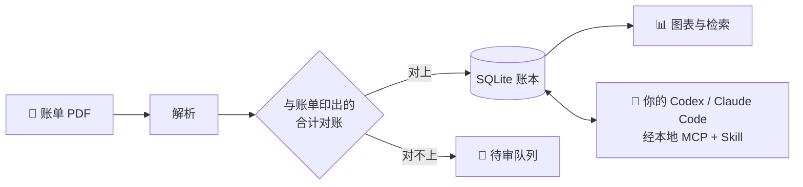

<div align="center">


# ledgerbox

**开源的本地 AI 账本 · 一个拒绝自己证明不了的数字的个人账本。**

[](https://github.com/51351879/Open-ledgerbox/actions)
[](LICENSE)
[](#-支持范围真正能用的部分)
[](CHANGELOG.md)

[English](README.md) · **简体中文**

把一份银行账单 PDF 拖到**你自己电脑上**运行的页面里。
它会被解析、**与账单自己印着的合计逐项对账**，通过了才入账。
你自己的 AI——Codex 或 Claude Code——通过一条严格的本地桥来分类。
除非你亲手连接，否则没有任何东西离开这台电脑。

</div>

---

## 亮点

|  |  |
|---|---|
| 🏠 **本地优先** | 一个 SQLite 文件，放在你选的文件夹里。无云端、无账号、无遥测、无 API key。 |
| 🧾 **对得上才入账，对不上就拒收** | 每次导入都必须与账单印出的合计相符。对不上的账单进待审队列——绝不进你的图表。 |
| 🤖 **自带 AI** | 通过 MCP + 官方 Skill 连接你**本来就装着的** Codex 或 Claude Code。ledgerbox 自己从不调用模型。 |
| 🧠 **它跟你学** | 一个商户你答一次，此后每一条相同的行——现在的和以后导入的——都跟着走。剩下的用常驻规则一句话敕令（"每一笔转出的 Zelle 都算现金支出"）。 |
| 💰 **大额必须过人眼** | 超过 $1,000 且没有人确认过的行，单独列在一块板上，直到你亲自看过。 |
| 🔍 **诚实是结构，不是态度** | 只用整数最小单位。内容哈希做身份。每个答案都写明是谁决定的——一条规则、AI、你早先的回答，还是你本人。 |

## 它怎么工作



AI 只提出建议；账本**原子地、带来源地**应用，并且可以整轮撤回。
证据不足时 AI 必须弃权——对你的钱做猜测是一个被拒绝的动作，不是一项功能。

## 快速开始

```bash
git clone https://github.com/51351879/Open-ledgerbox.git
cd Open-ledgerbox
```

**一句话的做法** —— 在这个目录里打开 Codex 或 Claude Code，然后说：

> 帮我 set up 这个项目 / set this project up

仓库里带的 setup Skill 会先问你数据放在哪里，然后把该做的都做掉。

**手动的做法：**

```bash
python -m venv .venv
.venv\Scripts\pip install -e .[mcp]
.venv\Scripts\ledgerbox setup --client claude --data-dir C:\ledger-data\my
```

然后双击 `start-ledgerbox.cmd`，打开页面，把账单拖进去。

## ⚠️ 支持范围：真正能用的部分

这里的"支持"只有一个意思：**在真实硬件上、用真实账单验证过**——别的都配不上这个词。

| 输入 | 状态 |
|---|---|
| Chase（美国）个人**支票**账户 PDF | ✅ 已用 13 份真实账单验证 |
| 通用 **CSV**（自己映射列） | 🔜 计划中——能覆盖大多数银行与信用卡 |
| 其他银行 / 信用卡 / 券商 | ❌ 尚未支持——见 [接入一家银行](docs/ADDING_A_BANK.md) |

| 平台 | 状态 |
|---|---|
| Windows 11 + PowerShell + Chromium 系浏览器 | ✅ 支持；每一道闸门都在这里跑 |
| Windows 讲述人（Agent 流程） | ✅ 已做真实验收 |
| macOS / Linux / 其他浏览器与读屏器 | ❌ 未测试——欢迎社区带着自己的验证提 PR |

已发布到 PyPI：[`ledgerbox`](https://pypi.org/project/ledgerbox/)——用 `uvx ledgerbox --version` 一次性试跑，或 `pip install ledgerbox[mcp]` 后手动运行同一条 `ledgerbox setup` 命令。clone 仍是最顺的路径：一句话装机 Skill 随 checkout 分发。永远不会有云同步、不会去爬你的网银登录、不会有手机 App（[为什么](docs/AUTOMATION.md)）。

## 你的数据

```
<你选的文件夹>/       ← 你来选；必须在任何 git 仓库之外
├── ledger.db          ← 账本（SQLite，整数最小单位）
├── archive/           ← 原始 PDF，按内容寻址
└── expected-totals.json… 以及其余一切，都留在你自己的磁盘上
```

只监听回环地址，没有身份验证——不要把它暴露到本机之外。
AI 桥只暴露**五个读取/提案工具**，没有 SQL，没有文件路径；每一条交易描述符都当作不可信数据处理。
细节见 [THREAT_MODEL](docs/THREAT_MODEL.md) · [SECURITY](SECURITY.md)。

## 术语表

翻译最容易出事的地方是把一句有保留的话译成一句没保留的话。下表钉住关键词；
**分类 ID、金额格式、命令、文件名与 wire 上的字面值一律不翻**，因为读者要照着敲，机器要照着读。

| English | 中文 | 为什么这样译 |
|---|---|---|
| reconcile / reconciled | 对账 / 已对账 | 是与账单自报合计逐项相符，不是"核对了一下" |
| refused | 拒收 | 不是"失败"。账没入，也没有半条进库 |
| review queue | 待审队列 | 东西在那里等人，不是被丢弃 |
| abstain / abstention | 弃权 | 证据不足时的正确动作。遗漏不是缺陷，猜测才是 |
| provenance | 来源 | 谁做的决定：规则、AI、你早先的回答，还是你本人 |
| proposal | 提案 | 还没生效的建议 |
| withdraw a run | 整轮撤回 | 撤回那一轮 AI 的决定，保留之后的人工修改 |
| learned rule / standing rule | 学到的规则 / 常驻规则 | 前者从一次决定学来，后者由你直接敕令 |
| integer minor units | 整数最小单位 | 金额永不用浮点 |
| `review_first` / `automatic` | 不翻 | 它们是 wire 上的字面值 |
| `transfer` / `cash` / `cash-deposit` | 不翻 | 分类 ID 就是这些字符串本身 |
| BYOA | 自带 AI | Bring Your Own AI：模型是你的，密钥也是你的 |

## 了解更多

| | |
|---|---|
| 催生这个项目的那次审查 | [docs/PROJECT_SUMMARY.md](docs/PROJECT_SUMMARY.md) |
| 架构与设计决定 | [docs/ARCHITECTURE.md](docs/ARCHITECTURE.md) · [docs/STATUS.md](docs/STATUS.md) |
| 连接 Codex / Claude Code | [docs/AGENT_SETUP.md](docs/AGENT_SETUP.md) |
| 接入你的银行 | [docs/ADDING_A_BANK.md](docs/ADDING_A_BANK.md) |
| 参与贡献 | [CONTRIBUTING.md](CONTRIBUTING.md) |
| 改了什么 | [CHANGELOG.md](CHANGELOG.md) |

> 中文文档目前只有这一页。`docs/` 下全部是英文，这里不假装不是。

**它为什么存在，一口气说完：** 作者上一个解析器把余额列当成收入静默误读了一整年——一个真实约等于零的储蓄率被报成 78%——而每一份账单的第一页都印着正确的合计。十五行对账断言在第一天就能抓住它。把那条断言当真，到处都当真，就是这整个项目。

## 许可证

[AGPL-3.0-or-later](LICENSE) —— 对所有人免费，且改进也必须保持免费。
